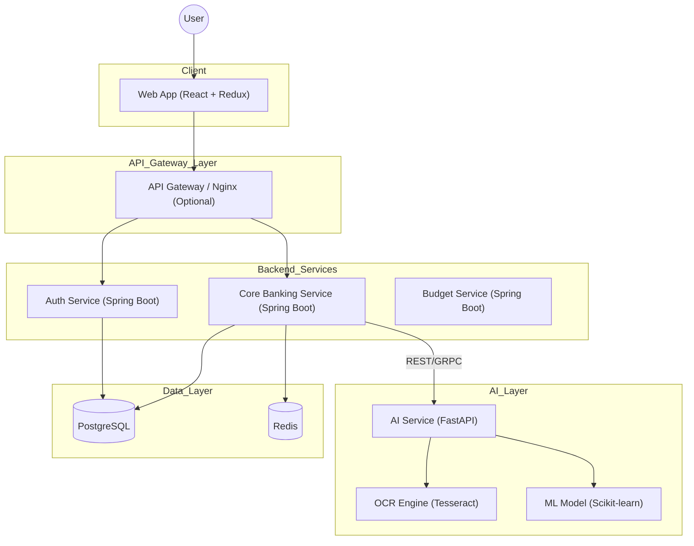

# System Architecture

## Overview
Paisafy uses a microservices-inspired layered architecture. The frontend communicates with the backend via REST APIs. The AI Service is a separate microservice handling ML tasks.

## High-Level Architecture Diagram

## Component Details
1. **Frontend**: React Single Page Application (SPA).
2. **Backend**: monolithic Spring Boot application modularized internally (or microservices if scaled).
3. **AI Service**: Python FastAPI for specialized ML tasks.
4. **Database**: PostgreSQL for transactional data.
5. **Cache**: Redis for session storage and frequent data caching.
