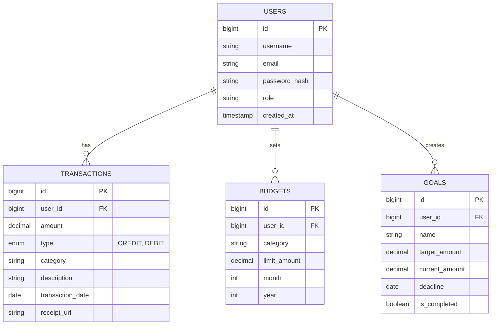

# Database Schema Design (PostgreSQL)

## ER Diagram

## Tables Description
- **users**: Stores user credentials and profile info.
- **transactions**: core table for all income and expenses.
- **budgets**: Monthly spending limits per category.
- **goals**: Savings targets for specific items (e.g., "Buy Laptop").
